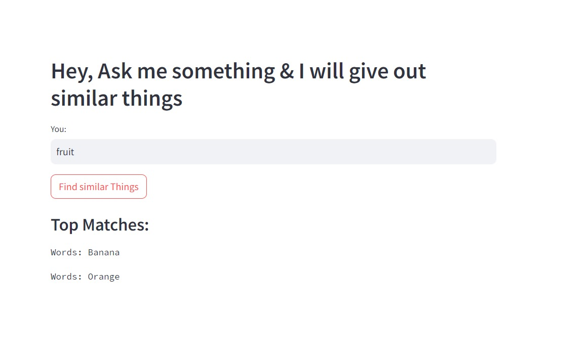

# Educate Kids
This is a Streamlit-based web application that helps find similar content from a CSV file using embeddings and FAISS for similarity search. The application is designed to assist in educational activities for kids by providing similar topics or concepts based on user queries.

## Features
<li>Load data from a CSV file.</li>
<li>Use HuggingFace embeddings for semantic search.</li>
<li>Perform similarity search using FAISS.</li>
<li>Interactive user interface to input queries and get results.</li>

