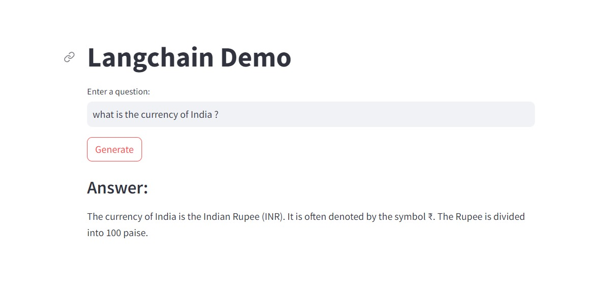

# LangChain and HuggingFace Integration Example-llm models
This project demonstrates how to use the LangChain library with OpenAI and HuggingFace to generate responses from language models.

## Requirements:
<li>Python 3.x</li>
<li>pip (Python package installer)</li>
<li>langchain</li>
<li>langchain-openai</li>
<li>openai</li>
<li>huggingface-hub</li>
<li>langchain_community</li>

## Attachment:
