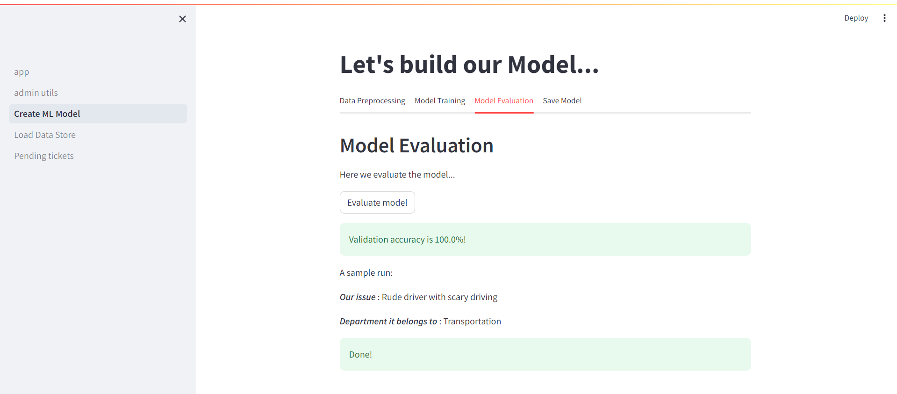
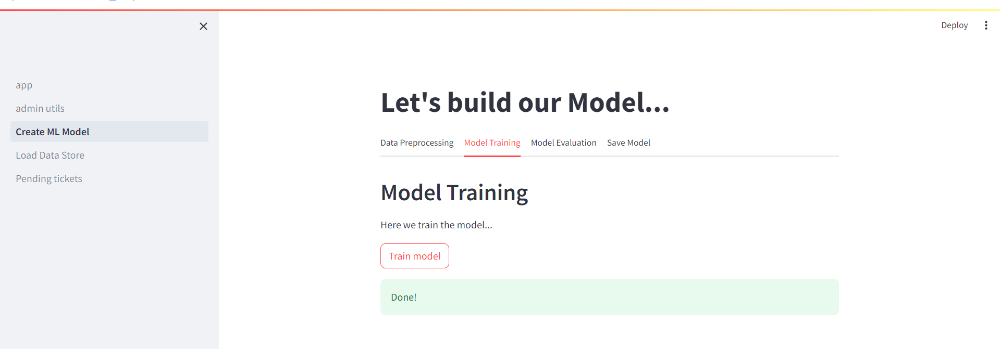
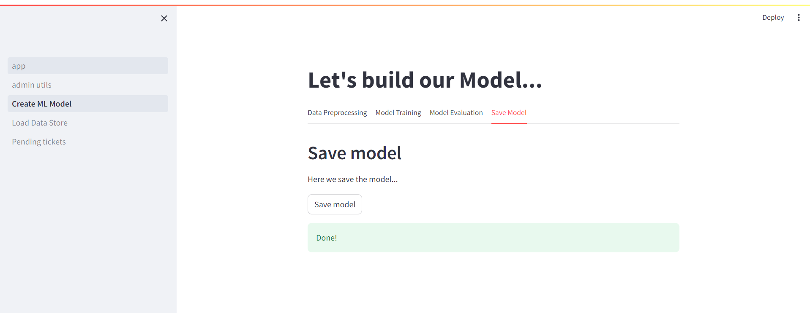
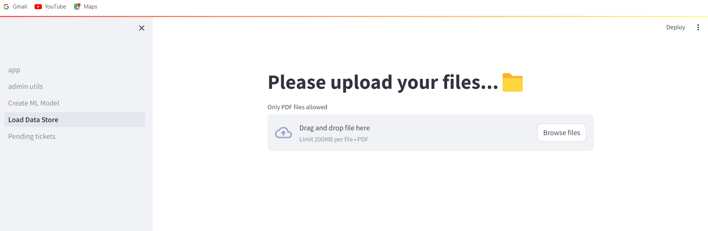
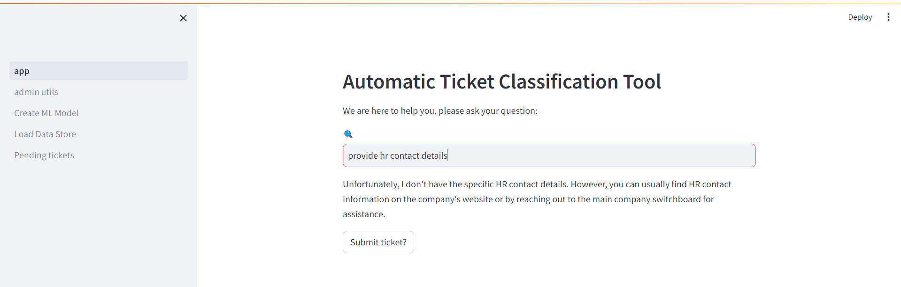
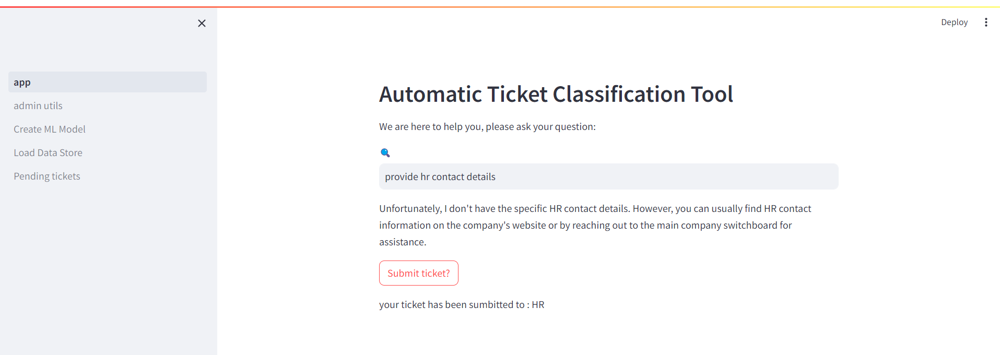
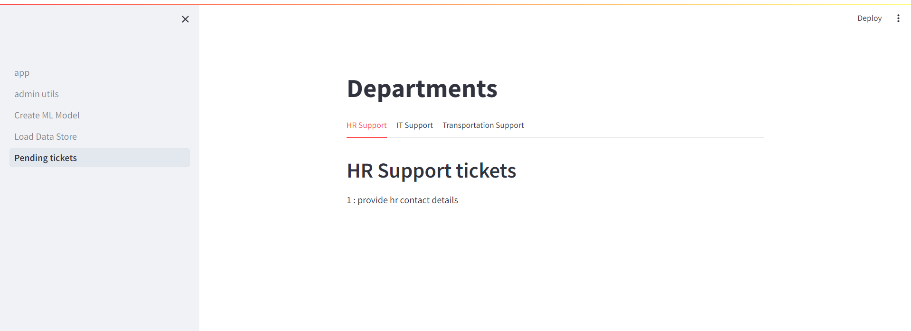

# Automatic Ticket Classification Tool
This project is a web application built using Streamlit that classifies user-submitted tickets into different departments (HR, IT, and Transport) based on the content of the ticket. The application leverages embeddings and machine learning models to analyze the input and determine the appropriate department for each ticket.

## Features
<li>Capture user input for ticket classification.</li>
<li>Classify tickets into HR, IT, or Transport departments.</li>
<li>Store classified tickets in session state for later use.</li>

## Technologies Used
<li>Streamlit: For building the interactive web application.</li>
<li>Pinecone: For storing and retrieving vector embeddings.</li>
<li>LangChain: To create and manage agents for processing data and queries.</li>
<li>Hugging Face: Provides the language model endpoint for natural language processing.</li>
<li>dotenv: For managing environment variables.</li>
<li>Python: General programming and scripting.</li>

