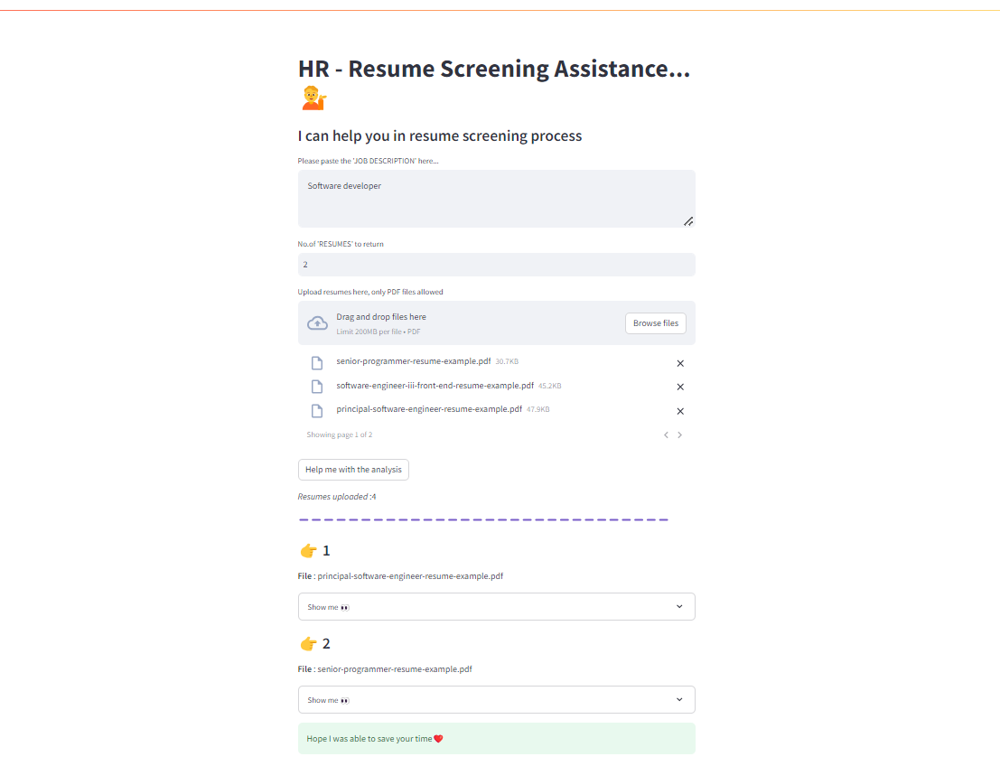

# Resume Screening Assistance
This project is a web application built using Streamlit that assists HR professionals in the resume screening process. The application allows users to upload multiple resumes in PDF format and provides relevant insights based on a given job description. It leverages embeddings and Pinecone for storing and retrieving relevant documents.

## Features
<li>Upload multiple PDF resumes.</li>
<li>Input job description for analysis.</li>
<li>Retrieve and display relevant resumes based on the job description.</li>
<li>Generate summaries of the relevant resumes.</li>

## Technologies Used
<li>Streamlit: For building the interactive web application.</li>
<li>Pinecone: For storing and retrieving vector embeddings.</li>
<li>LangChain: To create and manage agents for processing data and queries.</li>
<li>Hugging Face: Provides the language model endpoint for natural language processing.</li>
<li>dotenv: For managing environment variables.</li>
<li>Python: General programming and scripting.</li>

