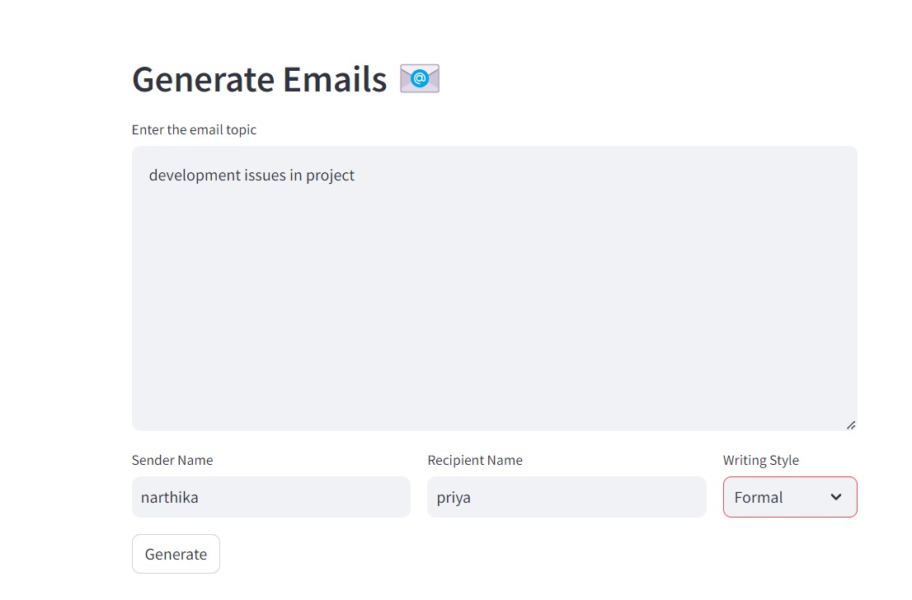

# Generate Emails Application
This project is a web application built using Streamlit that allows users to generate emails based on a given topic, sender name, recipient name, and writing style. It utilizes the Llama-2-7B-Chat model through the CTransformers library to generate the email content.

## Features
<li>Input email topic, sender name, recipient name, and select writing style.</li>
<li>Generate email content using the Llama-2-7B-Chat model.</li>
<li>Display the generated email content.</li>

## Technologies Used
<li>Streamlit: For building the interactive web application.</li>
<li>LangChain: To create and manage the prompt template for the email generation.</li>
<li>CTransformers: For utilizing the Llama-2-7B-Chat model to generate the email content.</li>

