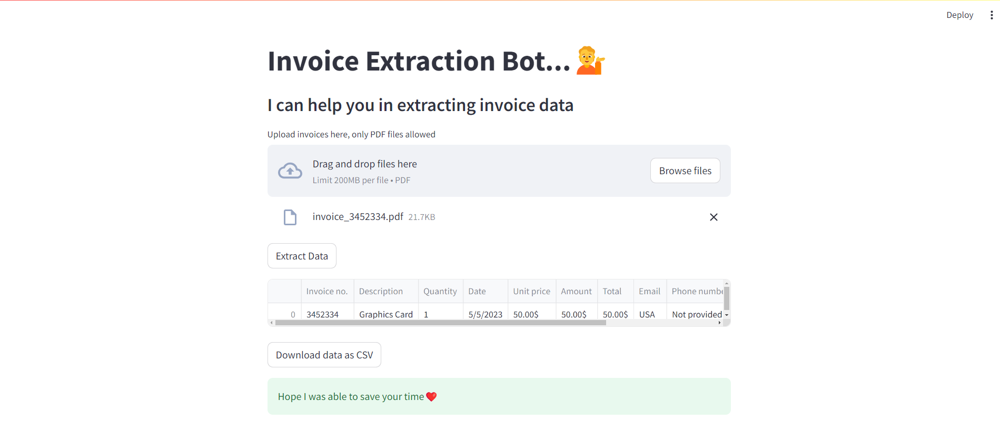

# Invoice Extraction Bot
This project is a web application built using Streamlit that assists users in extracting data from invoices in PDF format. The application allows users to upload multiple invoice PDFs and provides extracted data in a tabular format. Users can download the extracted data as a CSV file.

## Features
<li>Upload multiple PDF invoices.</li>
<li>Extract data from uploaded invoices.</li>
<li>View the extracted data in a table.</li>
<li>Download the extracted data as a CSV file.</li>

## Technologies Used
<li>Streamlit: For building the interactive web application.</li>
<li>dotenv: For managing environment variables.</li>
<li>Python: General programming and scripting.</li>

