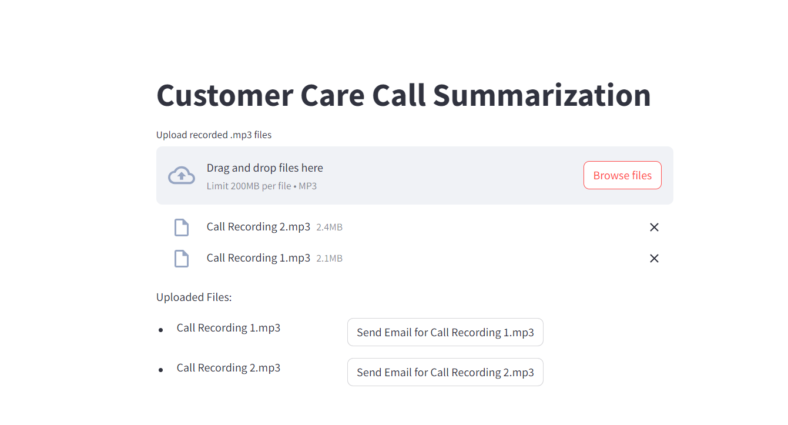

# Customer Care Call Summarization
This project is a web application built using Streamlit that allows users to upload multiple recorded .mp3 files of customer care calls and send summaries of these calls via email. The application leverages a utility function to handle the email summarization process.

## Features
<li>Upload multiple .mp3 files.</li>
<li>Display the uploaded files in a tabular format.</li>
<li>Send an email summary for each uploaded file.</li>

## Technologies Used
<li>Streamlit: For building the interactive web application.</li>
<li>Python: General programming and scripting</li>

