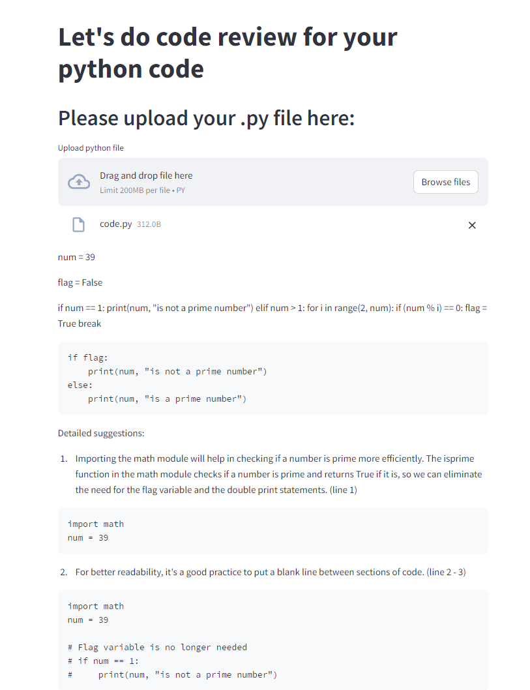

# Code Review Application
This project is a web application built using Streamlit and LangChain that allows users to upload Python files and receive detailed code reviews. The application leverages language models from Hugging Face to provide insights and suggestions for improving the uploaded code.

## Features:
<li>Upload a Python (.py) file.</li>
<li>Receive detailed code review and improvement suggestions.</li>
<li>Download the review analysis as a text file.</li>

## Technologies Used:
<li>Streamlit: For building the interactive web application.</li>
<li>LangChain: To manage interactions with language models.</li>
<li>Hugging Face: Provides the language model endpoint for natural language processing.</li>
<li>Python: General programming and scripting.</li>

## Attachment:

