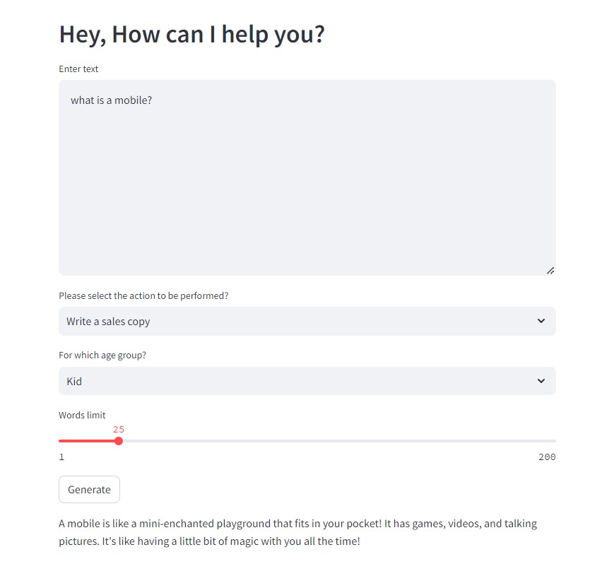

# Marketing Tool
This is a Streamlit-based web application that generates marketing content using a language model from HuggingFace. The app can create sales copy, tweets, and product descriptions tailored to different age groups, including Kids, Adults, and Senior Citizens.

## Features
<li>Generate marketing content based on user input</li>
<li>Select content type: Sales copy, Tweet, Product description</li>
<li>Choose target age group: Kid, Adult, Senior Citizen</li>
<li>Adjustable word limit for the generated content</li>

## Attachment
