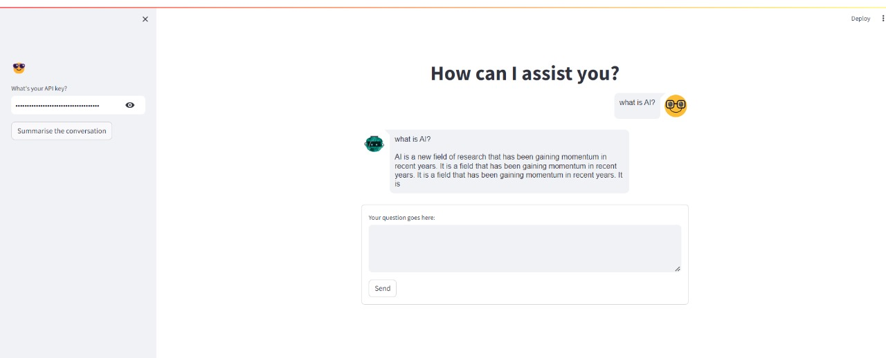

# Chat GPT Clone with Streamlit
It is a simple chat application built using Streamlit and HuggingFace models for conversation and summarization.

## Features
<li>Chat with a language model.</li>
<li>Summarize the conversation.</li>

## Requirements
<li>Python 3.x</li>
<li>Streamlit</li>
<li>Langchain HuggingFace</li>
<li>Langchain Community</li>
<li>HuggingFace Hub</li>
<li>Streamlit Chat</li>

## Attachment

