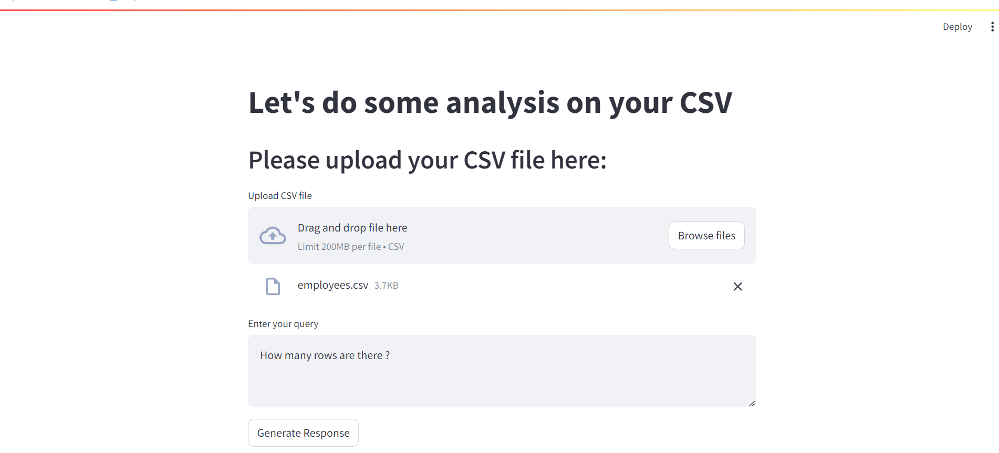

# CSV Analysis App
This project is a web application built using Streamlit that allows users to upload a CSV file and perform various analyses based on their queries. The application leverages the LangChain framework and a Hugging Face language model to process the data and provide insights.

## Features
<li>Upload a CSV file.</li>
<li>Enter a query to perform analysis on the uploaded data.</li>
<li>Receive responses and observations based on the query.</li>

## Technologies Used
<li>Streamlit: For building the interactive web application.</li>
<li>LangChain: To create and manage agents for processing data and queries.</li>
<li>Hugging Face: Provides the language model endpoint for natural language processing.</li>
<li>Pandas: For data manipulation and analysis.</li>

