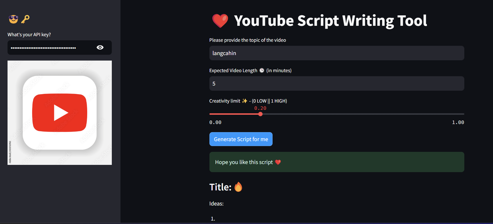
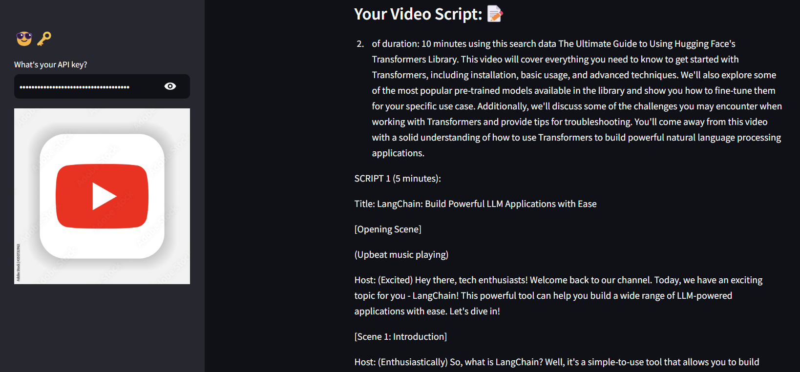

# YouTube Script Writing Tool
This is a Streamlit application designed to help you generate YouTube video scripts using the Hugging Face API. The app captures user inputs for the video topic, expected video length, and creativity level, and then generates a script based on these inputs.

## Features
<li>Styled Buttons: Custom styling for buttons.</li>
<li>Session State Management: Uses Streamlit's session state to manage the OpenAI API key securely.</li>
<li>Sidebar Input: Capture the OpenAI API key from the user.</li>
<li>User Inputs: Capture video topic, expected video length, and creativity level from the user.</li>
<li>Script Generation: Generates a YouTube video script using the OpenAI API.</li>
<li>Display Results: Displays the generated title, script, and search engine results.</li>

## Usage
<li>Open the app in your browser.</li>
<li>Enter your OpenAI API key in the sidebar.</li>
<li>Provide the topic of your video, expected video length, and set the creativity limit.</li>
<li>Click on "Generate Script for me" to get the script.</li>
<li>View the generated title, script, and search engine   results.</li>

