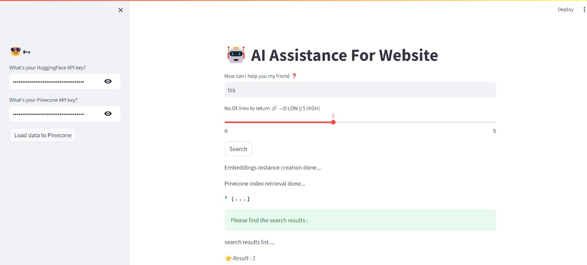
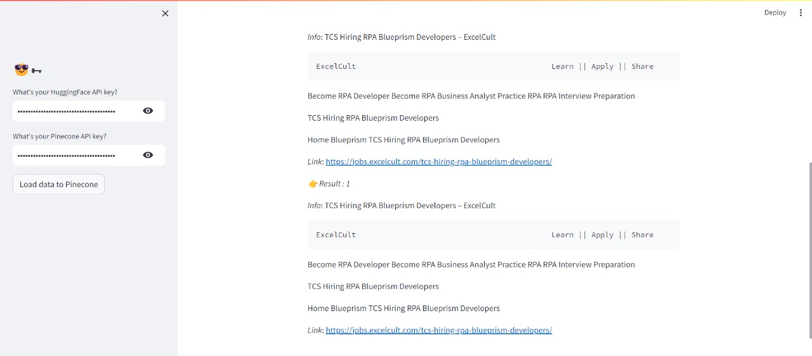

# AI Assistance For Website
This is a Streamlit application designed to provide AI assistance for website data retrieval and search functionality using the HuggingFace and Pinecone APIs. The app captures user inputs for the search query and returns relevant documents based on the query.

## Features
<li>Session State Management: Uses Streamlit's session state to manage the HuggingFace and Pinecone API keys securely.</li>
<li>Sidebar Input: Capture the HuggingFace and Pinecone API keys from the user.</li>
<li>Data Loading: Load data from a website to Pinecone for indexing.</li>
<li>Search Functionality: Retrieve relevant documents from Pinecone based on user queries.</li>
<li>Display Results: Displays the relevant documents and their sources.</li>

## Key Components
<li>API Key Management: Securely captures and manages HuggingFace and Pinecone API keys.</li>
<li>Data Loading to Pinecone:
<ul>
<li>Fetches data from a specified website.</li>
<li>Splits the data into manageable chunks.</li>
<li>Creates embeddings for the data chunks.</li>
<li>Pushes the embeddings and data chunks to Pinecone for indexing.</li>
<ul>
</li>

